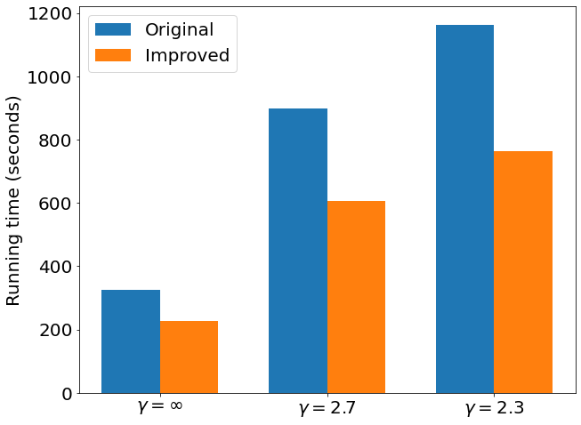

# belief_propagation_dcsbm
This repository provides an implementation of the belief propagtion (BP) algorithm for fitting the degree-corrected stochastic block model (DC-SBM) as defined in [1]. This implementation is built on the <a href="https://graph-tool.skewed.de/">graph-tool library</a>[2]. The main motivation behind this repository is to demonstrate how to put the BP algorithm into practice. We hope this could be helpful for those who come across the BP for the first time and like to build their own implementations.

Run the following code to see whether the BP algorithm is really working.
```
python3.9 text_bp_accuracy.py

# output

Is modified: False Partition overlap before BP: 0.51
Is modified: False Partition overlap after BP: 0.945
```

Run the following code to see difference in running time between different ways of updating the BP equations. This comparison is related to two different ways of updating the BP equations as to be explained below.
```
python3.9 text_compare_bp_running_time.py

# output

One iteration of BP with the original update scheme takes: 11.91773271560669 secs
One iteration of BP with the improved update scheme takes: 5.926676273345947 secs
```

<p align="center">
<br>
<b>Comparison of the BP running time with different update scheme. Results are obtained with a C++ implementation which is more efficient than the one available in this repository. However, making Python and C++ work together requires more careful setup, so we only present the results here.  </b>
</p>
<br/><br/>

The BP algorithm for the DC-SBM requires to update a series of BP equations,

<p align="center">

</p>

where the function *g* is the Poisson probability 
<p align="center">


and the  is defined as 

<p align="center">

</p>

The marginal probability distribution of the node *u* is given by 

<p align="center">

</p>

#### References in the table:
<p><a>[1] X. Yan, J. E. Jensen, F. Krzakala, C. Moore, C. R. Shalizi,
L. Zdeborova, P. Zhang, and Y. Zhu, Model Selection for
Degree-Corrected Block Models, 2014.</a>
<p><a>[2] Tiago P. Peixoto. The graph-tool python library. figshare, 2014. </a>
